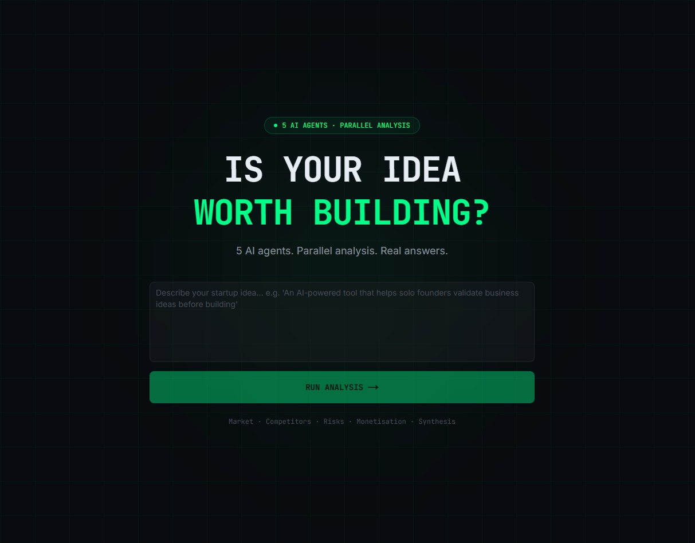
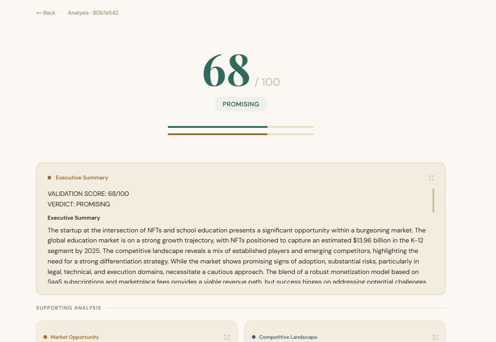

# Venture Analyst

> Five AI agents dissect your startup idea in parallel - market, competition, risk, monetisation, synthesis - and return a scored verdict in real time.



---

## How it works

Submit a one-line idea. Four specialist agents immediately fan out, each running concurrently and streaming their findings token by token. Once all four finish, a synthesis agent merges the outputs, scores the idea from 0–100, and issues a final verdict.

```
idea submitted
      │
      ├─── Market Research  ──┐
      ├─── Competitor Intel ──┤  (parallel)
      ├─── Risk Assessment  ──┤
      └─── Monetisation     ──┘
                               │
                         Synthesis
                               │
                         score + verdict
```

Events stream over SSE as they happen - thinking, tool calls, tokens, completion - so the UI updates live without polling.

---

## Running locally

**You need:** Python 3.11+, [`uv`](https://docs.astral.sh/uv/), Node.js 18+, [`pnpm`](https://pnpm.io/), and API keys for OpenAI and Tavily.

```bash
# 1. Backend
cd backend
cp .env.example .env          # add OPENAI_API_KEY and TAVILY_API_KEY
uv sync --group dev
uv run uvicorn main:app --reload

# 2. Frontend (new terminal)
cd frontend
pnpm install
pnpm dev
```

Open `http://localhost:3000`.

---

## Agents

| Agent | What it investigates | Searches the web |
|---|---|:---:|
| Market Research | TAM, trends, target users | ✓ |
| Competitor Intel | Top competitors, positioning gaps | ✓ |
| Risk Assessment | Legal, technical, execution risks | |
| Monetisation | Revenue models, pricing channels | |
| Synthesis | Merges all outputs → score 0–100 | |

---



## API

Three endpoints, nothing more:

```
POST /api/validate           { idea }  →  { job_id }
GET  /api/stream/{job_id}              →  SSE stream
GET  /api/result/{job_id}              →  scored result
```

Every SSE event is a flat JSON object:

```json
{ "agent": "market_research", "type": "token", "data": "..." }
```

Event types in order: `thinking` → `tool_call` → `tool_result` → `token` → `complete`. The stream closes on `system.done`.

---

## Stack

**Backend** - FastAPI · Uvicorn · Pydantic v2 · OpenAI · SSE-Starlette · Tavily · Loguru · Ruff · Mypy

**Frontend** - Next.js App Router · Turbopack · shadcn/ui · Tailwind CSS · Zustand · Framer Motion

---

## Project layout

```
backend/
├── main.py                   ← FastAPI app + CORS + Loguru
├── api/routes.py             ← three endpoints
├── core/
│   ├── orchestrator.py       ← asyncio.gather fan-out
│   ├── streaming.py          ← SSE helpers
│   └── job_store.py          ← in-memory job registry
├── agents/
│   ├── base.py
│   ├── market_agent.py
│   ├── competitor_agent.py
│   ├── risk_agent.py
│   ├── monetisation_agent.py
│   └── synthesis_agent.py
└── schemas/                  ← Pydantic event / request / response models

frontend/
├── app/
│   ├── page.tsx              ← landing + idea input
│   ├── validate/page.tsx     ← live streaming dashboard
│   └── result/[jobId]/       ← final scored report
├── components/analysis/      ← AgentOutputCard, ActivityFeed, SynthesisOutput …
├── components/report/        ← ValidationScore
├── hooks/useAgentStream.ts   ← EventSource → Zustand
└── store/agentStore.ts       ← global state
```

---

## Linting

```bash
# backend - ruff + mypy in one shot
cd backend && uv run python lint.py

# frontend - ESLint
cd frontend && pnpm lint
```
